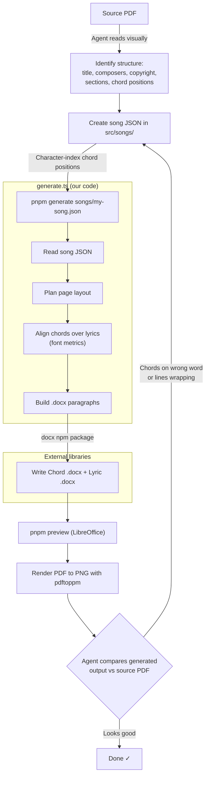

# 🎸 Church Music Generator

> _Because manually formatting chord sheets is not how you want to spend your Saturday night._

This tool generates professional-looking chord sheets and lyric sheets as `.docx` files, formatted in the Providence Church house style. Feed it a song's chords and lyrics as a simple JSON file, and out pop two perfectly formatted documents — one with chords, one without.

## Quick Start

```bash
pnpm install
pnpm generate songs/my-song.json
```

That's it. Check the `generated/` folder for your shiny new `.docx` files.

## How It Works

1. **Describe your song** as a JSON file in `src/songs/` (see below)
2. **Run the build** — the generator creates both a chord sheet and a lyric sheet
3. **Automatic verification** — the build checks that everything fits within 2 pages

### Song JSON Format

Drop a file like this in `src/songs/`:

```json
{
  "title": "Amazing Grace",
  "composers": "John Newton",
  "copyright": "© Public Domain",
  "sections": [
    {
      "type": "intro",
      "chords": ["G    D    G"]
    },
    {
      "type": "verse",
      "number": 1,
      "lines": [
        {
          "chords": [
            ["G", 0],
            ["C", 15],
            ["G", 24]
          ],
          "lyrics": "Amazing grace how sweet the sound"
        },
        {
          "chords": [
            ["G", 0],
            ["D", 15]
          ],
          "lyrics": "That saved a wretch like me"
        }
      ]
    },
    {
      "type": "chorus",
      "lines": [
        {
          "chords": [
            ["C", 0],
            ["G", 5],
            ["D", 10],
            ["G", 15]
          ],
          "lyrics": "Hallelujah what a Savior"
        }
      ]
    }
  ]
}
```

**Section types** match the source material (e.g., `intro`, `verse`, `chorus`, `bridge`, `tag`)

- `verse` sections require a `number` field
- `intro` sections have `chords` (array of strings) instead of `lines`
- All other sections have `lines` with `chords` as `[chordName, charIndex]` pairs
- Each chord's `charIndex` is a 0-based offset into the `lyrics` string identifying which syllable the chord sits above

## What You Get

For each song, two documents land in `generated/`:

- **`Song Name - Chord.docx`** — Chords above lyrics, sized for a music stand. Section labels, intro chords, the works.
- **`Song Name - Lyric.docx`** — Just the words. Great for projection or for people who don't want to think about Fsus4.

## The Rules

The generator follows some opinionated formatting rules:

- **2 pages max.** Nobody wants to flip pages mid-song.
- **Chorus on every page** if it fits. If space is tight, it appears once where it naturally falls.
- **Every verse gets chords** when possible. If space is tight, it'll drop chords from middle verses first.
- **Sections never split across pages.** The whole verse stays together.
- **Long lines shrink** (down to 15pt) before they wrap. If even that won't fit, it'll ask for help.
- **Reduce section gaps if needed.** The standard gap between sections is two empty lines (chord sheets) or one empty line (lyric sheets). If the page is tight, reduce a section gap from two to one to make content fit. Prefer this over dropping chords from a verse.
- **Space at top of subsequent pages.** After a page break, add two empty lines at the top of the new page (before the first section), as long as it doesn't push the document over the 2-page limit.

## Agent Workflow

When an agent generates a song from a source PDF, the process follows this flow:



Key points:

- The **agent** drives the entire process: reading the source, creating JSON, running commands, and verifying output
- **Chord positioning** is the hardest part — source PDFs use proportional fonts, so the agent must visually identify which word each chord sits above rather than estimating from column positions
- The **feedback loop** (compare → fix → regenerate) is critical for accuracy

## Pipeline

### Build Scripts

| Script               | Purpose                                                                                                                        |
| -------------------- | ------------------------------------------------------------------------------------------------------------------------------ |
| `src/generate.ts`    | Reads song JSON, generates both Chord and Lyric `.docx` files. Handles page layout automatically (page breaks, gap reduction). |
| `src/chord-align.ts` | Aligns chord strings over lyrics using approximate Arial font metrics so chords sit above the correct syllables.               |
| `src/verify.ts`      | Checks `.docx` files fit within 2 pages by extracting XML and estimating content height.                                       |
| `src/build.sh`       | Runs generate + verify in one step.                                                                                            |
| `src/check-deps.sh`  | Verifies all required and optional system dependencies are installed.                                                          |
| `src/preview.sh`     | Converts generated `.docx` files to PDF via LibreOffice and opens them for visual review.                                      |

Build a single song:

```bash
pnpm generate songs/my-song.json       # path relative to src/
pnpm generate src/songs/my-song.json   # path from project root also works
```

Build all songs:

```bash
pnpm generate
```

### Utilities

```bash
pnpm check-deps                      # Verify system dependencies
pnpm preview                         # Convert all .docx to PDF and open
pnpm preview "Song Name"             # Preview one song
pnpm preview "Song Name" --no-open   # Convert only, don't open
pnpm clean-previews                  # Remove preview files (auto-cleaned on next preview)
```

### Development

```bash
pnpm typecheck   # Type check with tsc
pnpm lint        # Lint with ESLint
pnpm format      # Check formatting with Prettier
pnpm test        # Run unit tests with Vitest
```

### Input Sources

- Chord charts may come as PDFs — extract text with `pdftotext -f [page] -l [page] file.pdf` and render with `pdftoppm -jpeg -r 150` for visual reference
- The user will specify which key/page to use from multi-key PDFs
- Existing `.doc` files can be read with `textutil -convert txt -stdout` on macOS

### Source Sheets (Reference)

Existing chord sheets: `/Users/nathan/Google Drive/My Drive/Music/Chord Sheets/`
Existing lyric sheets: `/Users/nathan/Google Drive/My Drive/Music/Lyric Sheets/`

These are `.doc` and `.docx` files. Use them as formatting reference. The `.docx` files can be unpacked for XML inspection using the docx skill's unpack script. The `.doc` files can be read with `textutil -convert txt -stdout "file.doc"` on macOS.

## Project Structure

```
├── CLAUDE.md              # Symlink → AGENTS.md
├── AGENTS.md              # Detailed format spec (for AI agents)
├── README.md              # You are here
├── package.json
├── tsconfig.json
├── vitest.config.ts
├── eslint.config.mjs
├── generated/             # Output .docx files (git-ignored)
├── dist/                  # Compiled JS (git-ignored)
└── src/
    ├── __tests__/         # Unit tests (colocated with source)
    ├── build.sh           # One-command build + verify
    ├── check-deps.sh      # System dependency checker
    ├── preview.sh         # .docx → PDF preview via LibreOffice
    ├── types.ts           # Song data type definitions
    ├── chord-align.ts     # Chord-over-lyric alignment (font metrics)
    ├── layout.ts          # Page layout planning (pure logic)
    ├── generate.ts        # The generator engine
    ├── verify.ts          # Page count & height verification
    └── songs/             # Song JSON data files (git-ignored)
```

## Requirements

- Node.js (see `.nvmrc` for version)
- **pnpm** for package management
- **poppler** (`brew install poppler`) for PDF text extraction and rendering
- **LibreOffice** (`brew install --cask libreoffice`) — optional, for `pnpm preview`
- macOS `textutil` for reading legacy `.doc` files
- Run `pnpm install` then `pnpm check-deps` to verify everything is set up.
